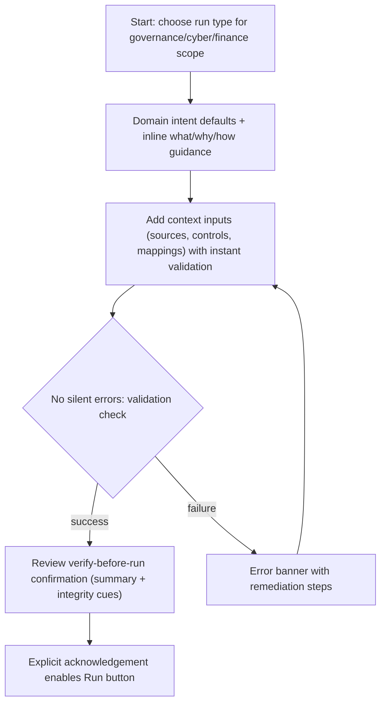
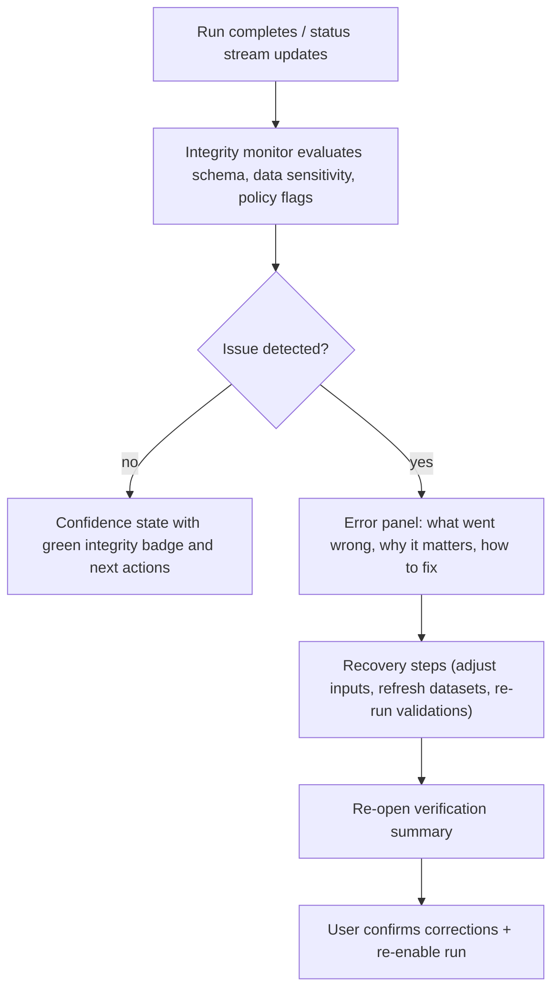
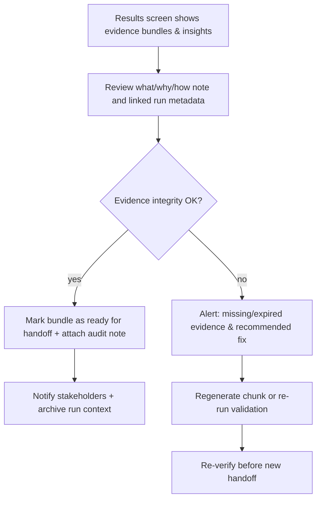

# UX Design Specification data-extraction-tool-main

**Author:** Andrewhana
**Date:** 2026-02-15T18:39:05-05:00

---

## Executive Summary
The data extraction platform should provide an intuitive, domain-aware UX that helps users understand the what, why, and how behind every configuration, input, action, and result, especially for governance, risk controls, cybersecurity, and financial-services use cases.

### Project Vision
Enable risk and compliance teams to run extraction workflows with confidence through clear task structure, consistent affordances, and embedded guidance, so users can make correct decisions quickly without external documentation.

### Target Users
Primary users are security analysts, risk/compliance officers, and control owners in regulated financial environments. They need fast execution plus traceability, policy alignment, and clear explanations of downstream impact.

### Key Design Challenges
- Present compliance-relevant controls and options without overwhelming users.
- Explain configuration dependencies and trade-offs before execution.
- Make asynchronous progress, data sensitivity, and result quality easy to interpret for audit and control workflows.

### Design Opportunities
- Add concise contextual info tips for each configuration/input/action/result using a what/why/how pattern.
- Organize workflows by domain intent (governance, cybersecurity, financial controls) to improve orientation and confidence.
- Add results callouts that connect extracted output to audit evidence, risk posture, and recommended next actions.

## Core User Experience

### Defining Experience
The core experience is a confidence-first workflow for regulated domains: users select a fit-for-purpose default, prepare context inputs, verify exactly what will run, execute, and interpret results with clear integrity signals. If this loop is effortless, adoption and trust follow.

### Platform Strategy
The product is desktop web only, optimized for mouse/keyboard workflows used by analysts and control teams. The experience should feel download-install-ready by minimizing setup friction and providing immediate value with safe defaults and guided first actions.

### Effortless Interactions
All four high-frequency interactions must be low-friction:
- Choosing configurations: recommended defaults with clear what/why/how tips.
- Preparing inputs: immediate validation, plain-language guidance, and visible readiness state.
- Launching runs: explicit verify-before-run confirmation with a clear summary of selections.
- Interpreting results: fast visual status, integrity cues, and direct next-step guidance.

### Critical Success Moments
- First run succeeds quickly using default settings with minimal setup.
- Users clearly see and confirm their selections before execution.
- Run start/completion states are unmistakable and easy to trust.
- Errors are never silent: users get immediate, actionable integrity and failure feedback.

### Experience Principles
- Default-safe by design: strong domain-aligned presets out of the box.
- Explain decisions in context: every key control includes concise what/why/how guidance.
- Verify before commit: major actions require clear visual confirmation.
- Make integrity observable: detect, surface, and explain issues immediately.

## Desired Emotional Response

### Primary Emotional Goals
- Confidence: reassure users that context cleansing for governance/risk/cyber/finance work is precise, traceable, and safeguarded before execution.
- Clarity: make it obvious what data is selected, why it matters, and how the system will act so the workflow feels purposeful.
- Control: communicate that strong defaults, confirmable selections, and verification hooks keep them in the driver's seat, preventing silent data or integrity regressions.

### Emotional Journey Mapping
1. Orientation: Calmly grounded via concise context and tooltips that explain the task's role in governance/cybersecurity diligence.
2. Assessment: Trust builds as smart defaults auto-populate, while what/why/how tips explain each choice.
3. Validation: A dedicated verify-before-run step gives users agency to review selections; visual cues show exactly what will change.
4. Execution Readiness: A clear confirmation state signals readiness and reduces stress before launch.
5. After Action: Post-run feedback affirms success and flags follow-up actions, maintaining confidence for repeat workflows.

### Micro-Emotions
- Relief from meaningful defaults instead of blank forms.
- Respect when the system explains why a selection matters.
- Assurance from explicit verification before run.
- Pride when output quality matches expectations without hidden loss.
- Calm readiness from clear selection confirmation and auditability.

### Design Implications
- Prioritize defaults first, with expandable what/why/how guidance.
- Require explicit verification acknowledgment before enabling run.
- Surface integrity checks and warnings early; no silent changes.
- Make failure states immediate, specific, and actionable.
- Keep result feedback concise and trust-oriented.

### Emotional Design Principles
- Anticipate anxiety: preview impacts and confirm before commit.
- Explain with empathy: practical guidance, not jargon.
- Reinforce reliability: show integrity signals at every critical step.
- Preserve momentum: smooth transitions and progressive disclosure.
- Celebrate control: confirmations and summaries should reflect user intent.

## UX Pattern Analysis & Inspiration

### Inspiring Products Analysis
1. Splunk-style analyst workspaces: strong signal prioritization, clear "why this matters" context, and investigation-driven views that keep operators oriented during high-stakes workflows.
2. ServiceNow GRC-style guided workflows: structured steps, explicit dependency visibility, and decision checkpoints that support auditability and reduce ambiguity.
3. Bloomberg/AIM-style operational consoles: dense but legible monitoring surfaces with execution transparency, status continuity, and clear failure visibility.

### Transferable UX Patterns
- What/Why/How Confirmation Cards: before run, summarize exactly what will execute, why it matters, and how outputs will be used.
- Verify-Before-Run Gating: require checklist confirmation for critical inputs/config choices before enabling execution.
- Session Health + Run Timeline: show latest run outcomes, integrity checks, and actionable error context in one continuous view.
- Contextual Tooltips at Decision Points: place micro-guidance directly beside risky or domain-sensitive controls, not in separate docs.

### Anti-Patterns to Avoid
- Silent failures or hidden integrity issues: never fail without immediate, plain-language cause and next action.
- Opaque config states: avoid generic toggles without clear scope/impact explanation.
- One-click reruns without review: force a concise re-verification step for reruns in regulated contexts.
- Fragmented confirmation UX: avoid making users piece together run intent across multiple screens.

### Design Inspiration Strategy
Adopt a workspace-first UX that combines run/session visibility with contextual explanation panels. Use explicit verification chips and checklist gating to prevent accidental execution. Keep all critical states legible: selected inputs, active configs, integrity status, and error remediation should be visible without drilling into logs. This preserves speed while maximizing trust, traceability, and control.

## Design System Foundation

### 1.1 Design System Choice
Use a themeable React design system: MUI (Material UI) as the primary foundation.

### Rationale for Selection
MUI gives strong accessibility, mature component coverage, and fast implementation for desktop enterprise workflows. It supports clear tooltip/dialog/stepper patterns needed for what/why/how guidance and verify-before-run confirmation. It also allows deep theming for a domain-specific, non-generic look.
Fallbacks: Fluent UI (Microsoft ecosystem fit) or Adobe Spectrum (strict enterprise/accessibility posture).

### Implementation Approach
Adopt MUI components for navigation, forms, tables, alerts, dialogs, and status patterns across run/jobs/sessions/config flows. Standardize critical interaction patterns:
- verification dialog before run,
- explicit selection summary block,
- non-silent error banners with actionable remediation,
- persistent integrity/status indicators in results and job detail surfaces.

### Customization Strategy
Create a design token layer (color, type, spacing, status semantics) and wrap key MUI primitives with project-specific components (`VerifyBeforeRunDialog`, `IntegrityStatusBanner`, `GuidanceTooltip`). Keep accessibility defaults intact while tailoring language and visuals for governance, cybersecurity, and financial-services workflows.

## 2. Core User Experience

### 2.1 Defining Experience
A confidence-first run builder for desktop GRC/cyber/finance analysts: pre-populated defaults orient the task, embedded what/why/how guidance explains every control, and a verify-before-run checkpoint summarizes selections before execution, ensuring no silent changes or integrity gaps slip through.

### 2.2 User Mental Model
Users approach this as a governed extraction task. They expect the system to provide sensible defaults, explain why each option matters, surface dependencies, and require confirmation of what will run because auditability and traceability are mandatory.

### 2.3 Success Criteria
- Domain-aligned defaults produce a ready-to-run setup with minimal manual effort.
- Every configuration/input decision has concise what/why/how guidance.
- Verify-before-run accurately mirrors execution intent and must be acknowledged.
- Errors and integrity issues are surfaced immediately with plain-language remediation.

### 2.4 Novel UX Patterns
Use a verify-before-run summary card with confirmation chips to force active review of execution intent. Pair contextual what/why/how tooltips with persistent integrity status banners so users always see quality/risk signals as they edit inputs.

### 2.5 Experience Mechanics
Initiation: User lands on a domain-tailored workspace with recommended defaults and inline guidance.  
Interaction: Input changes update a live execution preview; dependent controls disclose relationships.  
Feedback: Verification pane summarizes what will run, why it matters, and integrity checks; blocking issues prevent run.  
Completion: Launch and outcome states are explicit, with clear success/failure messaging, integrity status, and next steps.

## Visual Design Foundation

### Color System
- Primary surface: `#0B1F2B` (deep navy) for trust and control framing.
- Action accent: `#1DA1F2` for primary actions and focus states.
- Supporting neutral system: `#F5F7FA` (app bg), `#E3E8EF` (panel), `#1D2F3E` (primary text), `#B0BCCA` (secondary text), `#414F5E` (borders/dividers).
- Semantic states:
  - Success: `#2E7D32`
  - Warning: `#F57C00`
  - Error/Critical: `#D32F2F`
  - Info/Guidance: `#1565C0`
- Usage intent:
  - "What/Why/How" tips use `info` styling.
  - Verify-before-run readiness uses neutral -> success progression.
  - Integrity failures always use explicit error styling (never silent or muted).

### Typography System
- Primary UI font: `Public Sans` (forms, tables, controls, tooltips).
- Secondary display/font for authority cues: `IBM Plex Serif` (section headers and high-signal context blocks).
- Type scale:
  - `h1` 36/44
  - `h2` 28/36
  - `h3` 22/30
  - `body` 16/24
  - `caption` 14/20
- Weight hierarchy:
  - Heading: 600
  - Body: 400
  - Label/Caption: 500

### Spacing & Layout Foundation
- Grid: 12-column desktop grid, 24px gutters, max content width 1280px.
- Spacing scale (base 8):
  - 4, 8, 16, 24, 32, 48
- Rhythm:
  - 24px between major sections
  - 16px between related controls and helper text
  - 32px+ around high-risk confirmation areas (verify-before-run)
- Density posture:
  - Efficient but not cramped; optimize for analyst throughput with clear grouping.

### Accessibility Considerations
- Contrast targets:
  - 4.5:1 minimum for body text
  - 3:1 minimum for large text and non-text UI indicators
- Focus treatment:
  - `2px` visible outline + soft outer ring on all interactive controls.
- Error and integrity states:
  - Always combine color + icon + plain text message.
  - Blocking integrity failures must be announced and require resolution.
- Motion:
  - Subtle transitions (<=180ms), respect `prefers-reduced-motion`.

## Design Direction Decision

### Design Directions Explored
Eight directions were explored in the interactive HTML showcase:
1. Control Tower Workspace
2. Guided Run Builder
3. Session Health Timeline
4. Control Matrix Planner
5. Financial Reconciliation Studio
6. Cyber Triage Kanban
7. Audit Packet Composer
8. Command Center + Diagnostics

### Chosen Direction
Primary direction: Direction 2 - Guided Run Builder.
Blended elements:
- From Direction 3: immutable timeline and explicit integrity-failure narrative.
- From Direction 1: high-signal operations summary panel for session/job status.

### Design Rationale
Direction 2 gives the clearest confidence-first flow for your core interaction: configure -> understand -> verify -> run. It naturally supports what/why/how info tips at each step and enforces verify-before-run gating without overwhelming users. Adding Direction 3 timeline behavior ensures strong post-run traceability and no hidden failures, while Direction 1 summary widgets preserve operational visibility for regulated teams.

### Implementation Approach
Implement the Guided Run Builder as the default entry experience on desktop web with progressive sections and mandatory confirmation checkpoints. Add a persistent integrity/status rail and post-run timeline event stream. Keep a compact control-tower summary above or beside the flow to show session health, pending risks, and blocked actions at a glance.

## User Journey Flows
### Journey 1: Guided Run Setup and Verification
This path keeps the desktop workflow anchored in what/why/how guidance and enforces a verify-before-run gate so analysts never proceed with ambiguous intent. Defaults lock in domain-aligned choices, inline tips explain why each control matters, validation immediately fails noisily if inputs are incomplete, and the final confirmation card replays the what/why/how rationale before unlocking execution.

### Journey 2: Integrity Failure Detection and Remediation
After execution, integrity sensors surface issues without delay. The flow highlights whether a run failed compliance checks, then immediately offers what/why/how explanations plus concrete recovery steps before re-entering the verify gate.

### Journey 3: Evidence Review and Handoff
Evidence cards surface audit artifacts with context-sensitive annotations, letting users inspect outputs before handing them off to control owners. Missing evidence drives a remediation branch that triggers reprocessing and re-verification before handoff.

### Journey Patterns
- Guided verification checkpoints before progression.
- No silent failures; explicit, actionable error handling.
- Context-rich evidence artifacts tied to risk/audit impact.

### Flow Optimization Principles
- Start with domain defaults and progressively disclose complexity.
- Gate execution with explicit summary + acknowledgment.
- Treat error recovery as first-class UX, not edge case.
- Keep users in one desktop workspace with clear state continuity.
- Preserve traceability with run IDs and evidence lineage in every handoff.

## Component Strategy

### Design System Components
MUI provides the base layer for layout, forms, status, and navigation:
- Layout: `Grid`, `Stack`, `Box`, `Container`
- Flow/navigation: `Stepper`, `Tabs`
- Surfaces/text: `Card`, `Paper`, `Typography`, `Divider`
- Inputs/actions: `Button`, `IconButton`, `Chip`, `ToggleButton`, `Select`, `TextField`, `RadioGroup`
- Feedback/status: `Alert`, `Badge`, `Tooltip`, `Dialog`, `Snackbar`, `LinearProgress`, `Timeline`

Gap analysis:
- Need custom flow orchestration for verify-before-run gating.
- Need domain-specific integrity timeline behaviors.
- Need high-signal control tower console tied to session telemetry.
- Need evidence handoff cards with compliance metadata/remediation.

### Custom Components

### GuidedRunBuilderShell
**Purpose:** Orchestrate defaults -> input -> validation -> verification in one confidence-first workspace.  
**Usage:** Primary desktop entry for run setup.  
**Anatomy:** Header, staged sections, guidance rail, validation chips, confirmation rail.  
**States:** default, validation-failed, locked, complete.  
**Variants:** expanded, compact.  
**Accessibility:** region landmarks, logical focus order, assertive validation announcements.  
**Content Guidelines:** every section includes concise what/why/how text.  
**Interaction Behavior:** progression unlocks by stage; run remains locked until verification acknowledgment.

### VerifyBeforeRunSummaryCard
**Purpose:** Explicitly confirm execution intent before enabling run.  
**Usage:** Final stage in builder and optional modal confirmation.  
**Anatomy:** status header, what/why/how summary, integrity chips, detail links, acknowledgment action row.  
**States:** ready, warning, blocked, stale.  
**Variants:** full, compact.  
**Accessibility:** labeled region, live status updates, keyboard-operable acknowledgment.  
**Content Guidelines:** mirror real selected config/scope; explain why blockers prevent execution.  
**Interaction Behavior:** acknowledgment toggles run enablement; links jump to sections needing correction.

### IntegrityTimelineRail
**Purpose:** Display chronological run/integrity/remediation events with actionable context.  
**Usage:** Persistent side rail during run and post-run review.  
**Anatomy:** event spine, severity badges, timestamps, remediation links.  
**States:** healthy, warning, error, pending.  
**Variants:** full, mini.  
**Accessibility:** list semantics, keyboard event navigation, polite live updates.  
**Content Guidelines:** short event titles + plain-language impact/remediation.  
**Interaction Behavior:** selecting event opens associated remediation/evidence context.

### ControlTowerStatusConsole
**Purpose:** Provide at-a-glance session health, risks, and quick operational actions.  
**Usage:** Persistent summary panel in chosen hybrid direction.  
**Anatomy:** health banner, KPI row, risk chips, quick actions.  
**States:** nominal, degraded, blocked, offline.  
**Variants:** full console, compact widget.  
**Accessibility:** labeled region, focusable actions, live escalation announcements.  
**Content Guidelines:** prioritize pending approvals, integrity blockers, and evidence gaps.  
**Interaction Behavior:** chips deep-link to relevant builder/timeline/evidence sections.

### EvidenceHandoffCard
**Purpose:** Package audit-ready output with readiness status and remediation hooks.  
**Usage:** Results and handoff screens.  
**Anatomy:** metadata header, readiness badge, artifact list, what/why/how context, handoff actions.  
**States:** ready, missing, stale, in-progress.  
**Variants:** detailed card, summary row.  
**Accessibility:** assertive status changes, keyboard action flow, list semantics for artifacts.  
**Content Guidelines:** include run IDs, timestamps, policy mapping, and required next actions.  
**Interaction Behavior:** mark-ready/share/regenerate actions update timeline + control tower state.

### Component Implementation Strategy
Build all custom components as thin wrappers on MUI primitives, bound to shared run/integrity/evidence state. Centralize severity tokens, tooltip copy patterns, and status formatting so verification, timeline, console, and handoff components stay consistent and traceable.

### Implementation Roadmap
**Phase 1 (Core):** `GuidedRunBuilderShell` + `VerifyBeforeRunSummaryCard` with run-gating logic.  
**Phase 2 (Ops visibility):** `IntegrityTimelineRail` + `ControlTowerStatusConsole` wired to live state.  
**Phase 3 (Audit loop):** `EvidenceHandoffCard` with remediation loop back into verify-before-run flow.

## UX Consistency Patterns

### Button Hierarchy
- Primary actions: one per screen/section (e.g., `Verify and Run`, `Resolve and Continue`), high-emphasis style only.
- Secondary actions: supporting tasks (`Preview`, `View Details`, `Attach Note`) with medium emphasis.
- Tertiary/text actions: low-risk helpers (`Learn more`, `Open mapping details`).
- Destructive actions: explicit danger styling + confirmation dialog + reason capture.
- Rule: Run-related primary actions remain disabled until verification conditions pass.

### Feedback Patterns
- Success: explicit completion message + next-step CTA + trace ID/run ID.
- Warning: non-blocking amber state with clear recommendation and deadline/impact where relevant.
- Error (blocking): red state with plain-language cause, why it matters, and remediation steps.
- Info/guidance: blue what/why/how callouts near decision controls.
- Rule: never show generic failures; always include actionable remediation.

### Form Patterns
- Progressive sectioning by intent: defaults -> inputs -> policies -> verification.
- Inline validation on blur/change for critical fields; full validation at verify step.
- Required fields labeled in plain language; dependencies visible before selection.
- Confirmation summary mirrors actual execution payload.
- Rule: configuration changes after acknowledgment invalidate run readiness and require re-verify.

### Navigation Patterns
- Primary desktop IA: Guided Run Builder, Jobs, Sessions, Config, Evidence.
- Persistent context rails: Control Tower summary + Integrity Timeline for continuity.
- Deep-link patterns: risk chips and error cards jump directly to corrective section.
- Breadcrumb/context header includes session ID, config ID, and current state.

### Additional Patterns
- Modal/overlay: reserved for high-risk confirms, escalation, and irreversible actions.
- Loading states: skeletons and staged progress labels tied to real job phases.
- Empty states: explain what to do next with a single primary CTA.
- Search/filter: always show active filters as removable chips and include "clear all."
- Accessibility baseline: keyboard-complete operation, live-region announcements for status changes, and color+icon+text for all severity signals.

## Responsive Design & Accessibility

### Responsive Strategy
- Desktop-first primary experience (1024px+) for Guided Run Builder + Control Tower + Integrity Timeline in multi-column layouts.
- Tablet adaptation keeps full workflow but collapses side rails into toggleable panels/drawers.
- Mobile fallback prioritizes critical actions only: status review, approval/rejection, remediation follow-up, and evidence checks.
- Preserve task continuity across breakpoints: users should never lose verification context when layout changes.

### Breakpoint Strategy
- `xs`: 320-479 (minimal mobile fallback)
- `sm`: 480-767 (mobile enhanced)
- `md`: 768-1023 (tablet)
- `lg`: 1024-1439 (desktop baseline)
- `xl`: 1440+ (wide desktop analytics)
- Strategy: desktop-first design with explicit fallback behavior for `md` and below.

### Accessibility Strategy
- Target WCAG 2.2 AA compliance.
- Keyboard-complete workflows for all critical paths (setup, verify, run, remediate, handoff).
- Screen reader support with semantic landmarks and live-region updates for run/integrity status.
- Color is never the only signal: pair severity colors with icon + text.
- Minimum touch/click targets: 44x44 for interactive controls.
- Focus management in dialogs, drawers, and verification gates must be explicit and reversible.

### Testing Strategy
- Responsive testing across Chrome/Firefox/Safari/Edge and representative desktop/tablet/mobile widths.
- Accessibility automation: axe/Lighthouse in CI plus manual checks.
- Manual assistive testing:
  - keyboard-only traversal,
  - NVDA/VoiceOver screen reader passes,
  - high-contrast and reduced-motion checks,
  - color-blind simulation.
- Scenario testing for critical journeys:
  - verify-before-run gating,
  - integrity error remediation,
  - evidence handoff readiness.

### Implementation Guidelines
- Use semantic HTML and MUI accessibility primitives by default.
- Implement layout with responsive MUI Grid/Stack and breakpoint-aware composition.
- Use relative sizing (`rem`, `%`) and avoid fixed-height critical containers.
- Add `aria-live` regions for status transitions and integrity alerts.
- Standardize focus ring and status token usage from the visual foundation.
- Ensure layout collapse rules keep "What/Why/How" guidance and verification summary visible or one-click accessible.
